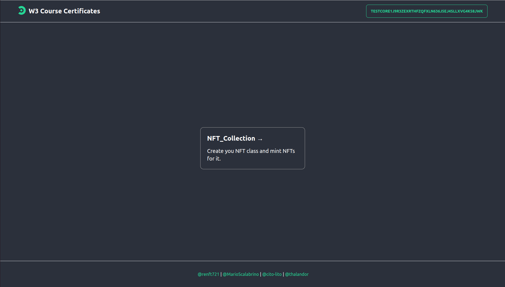
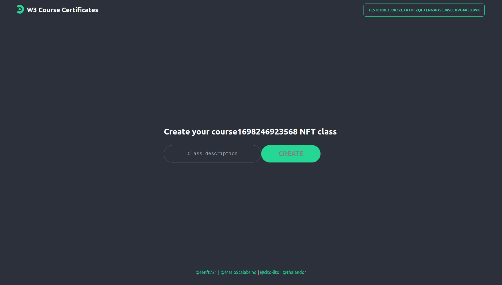
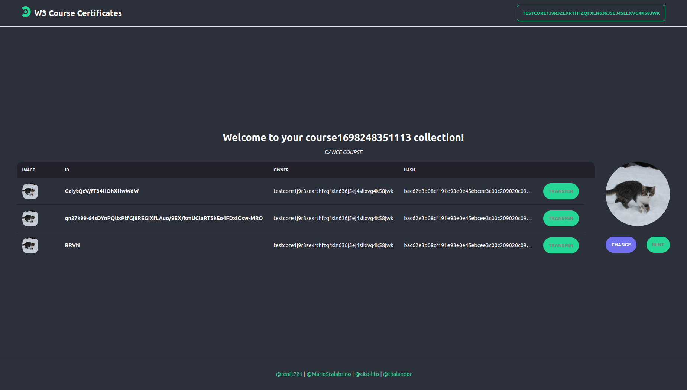
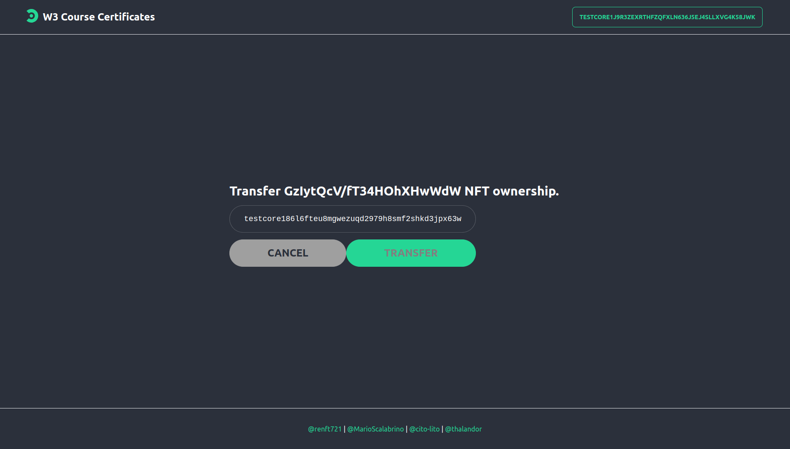
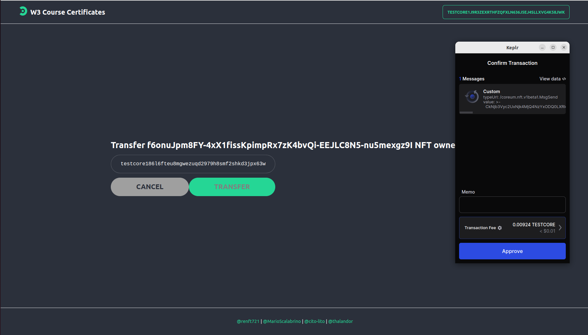
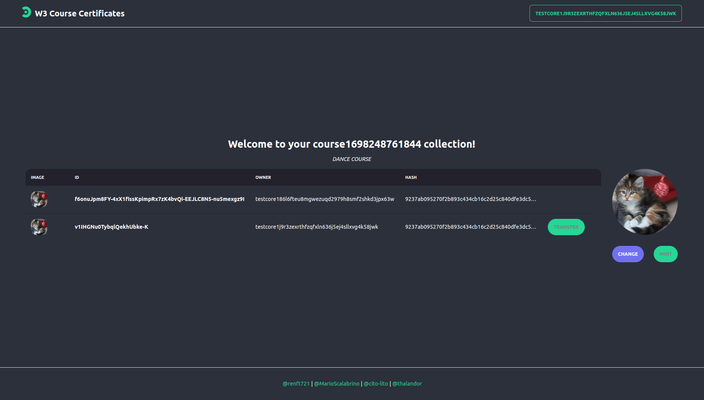

# web3-course-certification

# NFT CERTIFICATES

The first iteration of a platform that enables anyone to create an NFT Collection and distribute these NFTs to their community. These assets are securely bound using the whitelist feature of Coreum NFTs.

## Current status

The project initially was going to have a backend connected so users can be created, logged, can create courses and join them but we had some issues so the backend even if it's functional, it's completely unconnected so you can ignore the folder. The app right now allows you to create a collection and transfer it to other users (initially intended the students of the course the collection was created for).

## Getting Started

## run frontend:

- cd to frontend/ directory and Install dependencies

```
npm install
```

- Run

```
npm run dev
```

## Example: a teacher wants to create certificates for his students










## Authors

https://github.com/Thalandor
<br>
https://github.com/cito-lito
<br>
https://github.com/MarioScalabrino
<br>
https://github.com/renft721

## License

This project is licensed under the MIT License - see the LICENSE file for details
